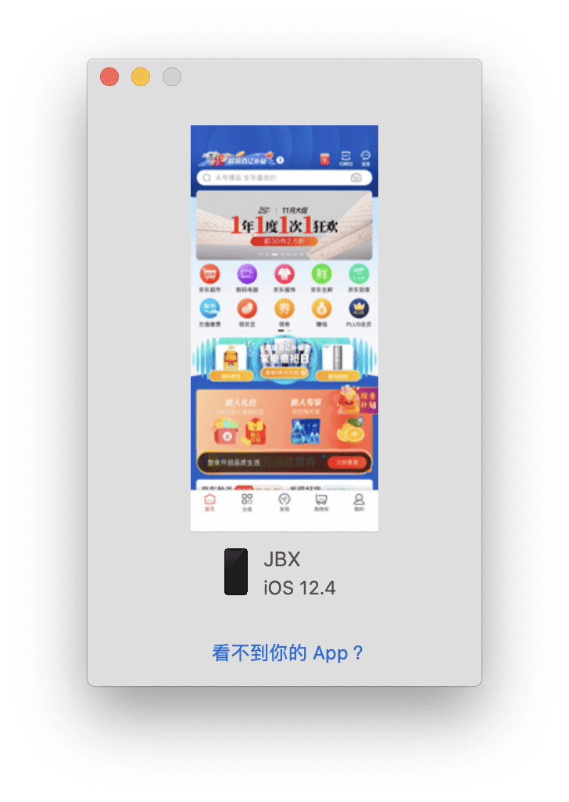
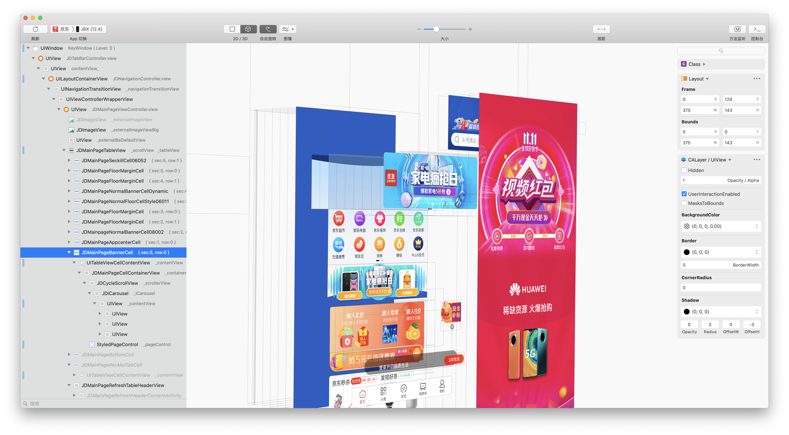

## 在越狱设备中使用 [Lookin](https://lookin.work/) 查看越狱设备所有安装的 App UI

### MonkeyDev 安装

- 下载 `Lookin` 安装到 Mac [Link](https://lookin.work/)
- 下载 `LookinServer.framework` [Link](https://github.com/QMUI/LookinServer/tree/master/LookinServer.framework)
- 将下载的 `LookinServer.framework` 拷贝到手机的 `/Library/MobileSubstrate/DynamicLibraries/` 目录
- 使用安装了 MonkeyDev 的 Xcode 运行项目

### 手动安装

- 下载 `Lookin` 安装到 Mac [Link](https://lookin.work/)
- 下载 `LookinServer.framework` [Link](https://github.com/QMUI/LookinServer/tree/master/LookinServer.framework)
- 以 `root` 用户连接越狱手机
- 将下载的 `LookinServer.framework` 和项目生成的 `LookinServerBridge.dylib` 和 `LookinServerBridge.plist` 拷贝到手机的 `/Library/MobileSubstrate/DynamicLibraries/` 目录

  > 当前项目代码生成的动态库路径 ./LookinServerBridge/Package/Library/MobileSubstrate/DynamicLibraries/

- 运行 `killall -9 SpringBoard` 重启 SpringBoard

> ⚠️ 注意:
>
> 1. `SpringBoard` 不加载动态库, 防止 Lookin 客户端点选错误
>
> 2. 安装包内包含了 `LookinServer.framework` 的 App (一般为 Debug App), 不需要额外加载动态库就可以连接 Lookin, 所以不再次加载动态库
>
> 3. 若出现 Lookin 提示动态库版本不匹配, 下载匹配的 `LookinServer.framework` 拷贝到手机的 `/usr/lib/TweakInject/` 目录即可

### 示例

